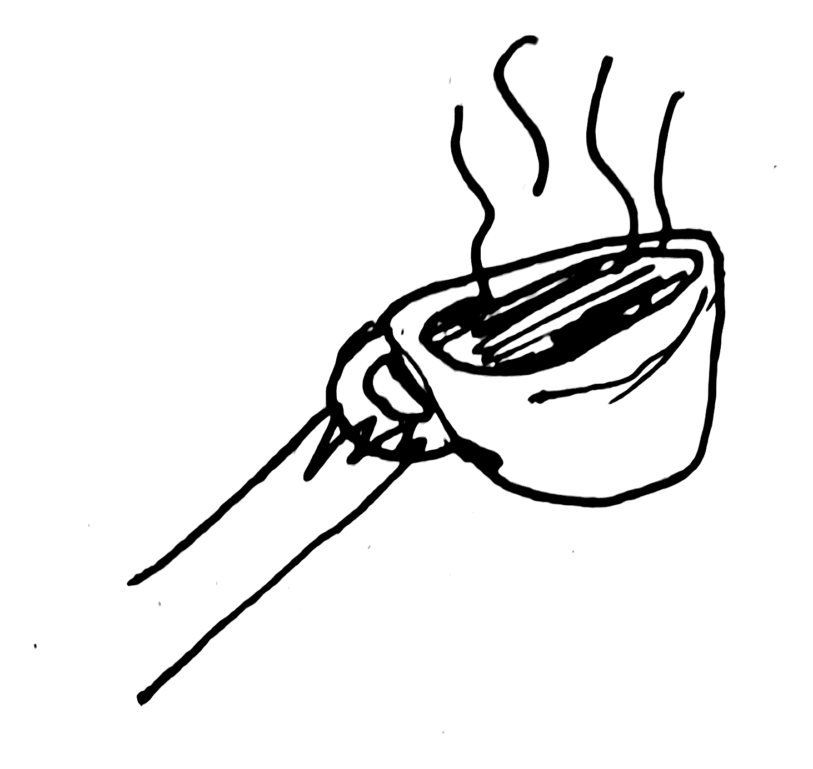
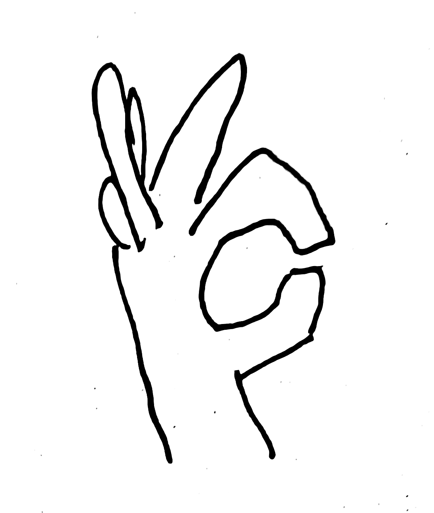
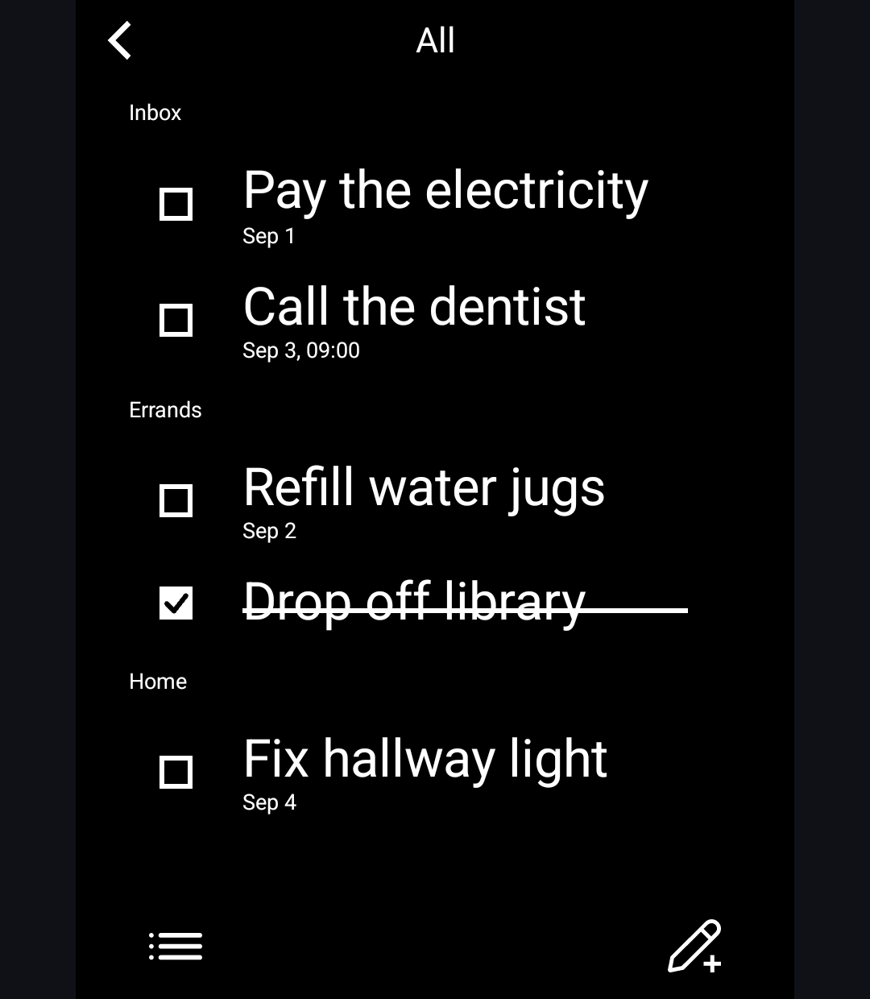
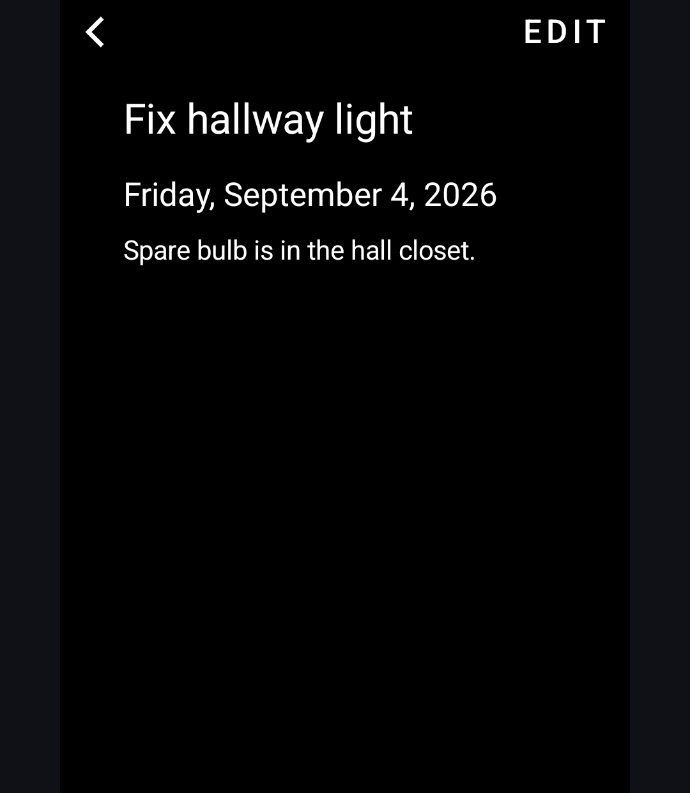
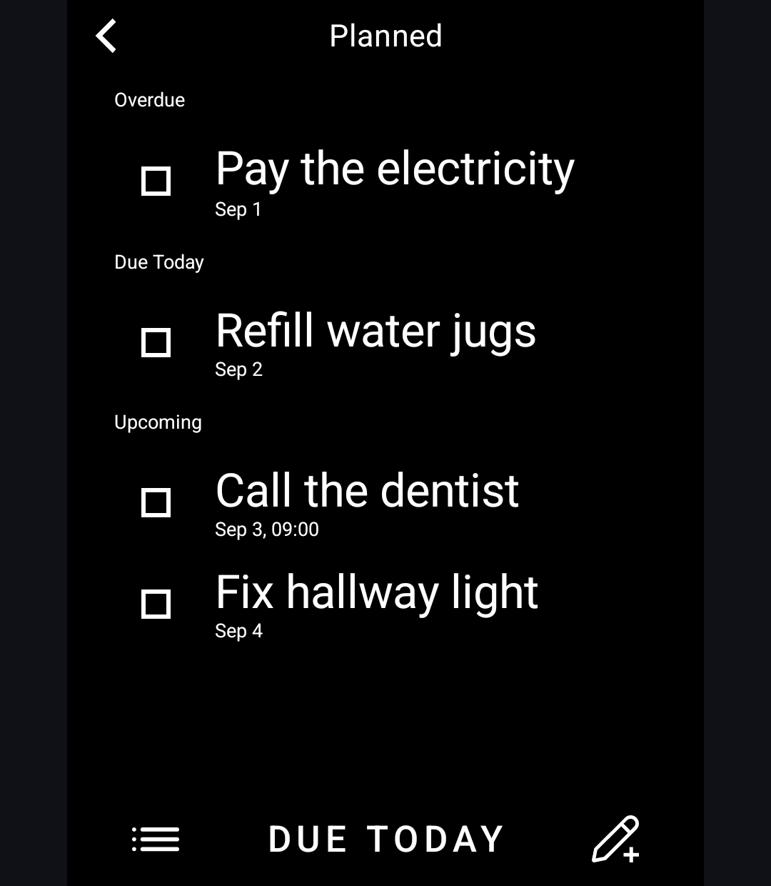

# Tasks

*A calm, local-first to-do list for the Light Phone III.*

<p align="center"><a href="https://ko-fi.com/fenleon">
  <picture><source media="(prefers-color-scheme: dark)" srcset="art/coffee-hand-filled-alpha-white-steam.png"></picture>
  <picture><source media="(prefers-color-scheme: dark)" srcset="art/buy-me-a-coffee-alpha-white.png"></picture>
  </a></p>

Tasks is a task list built specifically for the Light Phone III. Add tasks, file them into categories, check them off, and optionally set a due date and time — nothing more. There are no accounts, tags, subtasks, projects, widgets, or cloud backends. Everything lives in one small file on your device.

Built with the Light ethos: **stripped back, calm, and intentionally small**. Tasks is a **real LightOS tool**: a thin interface built on the Light SDK design system, launched from the LightOS toolbox, with **zero permissions**.

Tasks is in **beta**. It is suitable for daily use; features and behavior may still evolve before a stable release.

> **Current Status:** Beta
>
> **Current Version:** 0.2.0

<p align="center">Support my work by leaving me a <a href="https://ko-fi.com/fenleon">tip</a> or  <a href=https://github.com/sponsors/fenleon">sponsoring me</a>. A little goes a long way.</p>


---

# Screenshots

Tasks in the All, task details, and Planned views (light-on-black):

<p align="center">
  
  
  
</p>

---

# Features

- **Everything in one place** — All, Inbox, Planned, Completed, and your own categories as views from the bottom bar.
- **Planned view** — tasks with a due date grouped under Overdue, Due Today, and Upcoming, with a one-tap **Due Today** filter.
- **Due dates with an optional time** — picked from a minimal month-grid calendar and scroll columns; no reminders, just a date you chose to remember.
- **Categories** — file tasks into your own categories; rename or delete them from the categories panel.
- **Calm interactions** — a task is one tap to check off; details are read-only; everything follows the Light Phone design language.
- **Local-first** — the whole list is one `tasks.json` in the app's private storage. No account, no network, no sync.

---

# Getting Started

Tasks is a real LightOS tool and appears in the LightOS toolbox once installed:

1. Download the `app-release.apk` from the [latest release](https://github.com/fenleon/tasks/releases).
2. Install it (the release is signed with the SDK dev key, so on a real Light Phone you need External tools set to **All tools** in Developer options).
3. Open **Tasks** from the toolbox.

On the emulator: `adb install -r app-release.apk` is all it takes — the emulator accepts the dev signature as Light-signed.

---

# Development

Tasks is a standalone single-module Gradle project (`:tool`) that consumes the Light SDK as an included build.

## Requirements

- JDK 21
- Android SDK (API 36)
- A sibling checkout of the Light SDK at `../light-sdk` (consumed as an included build), e.g. the patched mirror at https://github.com/fenleon/light-sdk

## Build

```bash
./gradlew :tool:assembleDebug        # debug APK
./gradlew :tool:assembleRelease      # R8-minified release APK
./gradlew :tool:testDebugUnitTest    # unit tests
```

The release variant signs with the workspace dev key (`light-sdk/sdk/keys/lightsdk-dev.jks`) — sideloadable, treated as Light-signed by the LightOS emulator. See the repository's build files for details.

---

# Privacy

Tasks does not include analytics, advertising, telemetry, or user accounts. It holds no permissions and never touches the network. Your tasks stay in a JSON file on your device.

---

# Architecture

Tasks is a native Android application written in Kotlin using Jetpack Compose.

It is a **real LightOS tool**: the `:tool` module is built with the Light SDK's tool plugin and uses only SDK primitives and UI. Single-module build (the passes pattern): no embedded server — `serverPackage = "com.lightos"`, so all SDK server calls go to the platform's own `LightSdkService` (hardware keys and haptics included). The task store runs in-process: `TaskRepository` keeps an in-memory copy and write-through JSON at `tasks.json` in the tool's sandboxed files. Tasks is a standalone Gradle project that consumes the Light SDK as an included build — see `settings.gradle.kts`.

---

# Current Limitations

Tasks is designed for the Light Phone III and Android 14 (API 34) or newer.

- **No reminders yet** — v1 is a zero-permission tool, so due dates don't alert. Reminders are planned for when LightOS surfaces notifications on the standby screen.
- **No sync** — the list is local-only by design; a CalDAV sync plan exists for later.
- **One list, not a system** — no tags, subtasks, recurring tasks, or shared lists. By design: Tasks is not trying to become Todoist.

---

# Contributing

Contributions, bug reports, feature requests, and suggestions are welcome.

If you encounter a bug, please include:

- Tasks version
- Light Phone III software version
- Steps to reproduce
- Expected behavior
- Actual behavior

---

# Important

Tasks is an independent, unofficial open-source project.

Tasks is not affiliated with, endorsed by, sponsored by, or approved by The Light Phone, Inc.

Light Phone and Light OS are trademarks of The Light Phone, Inc.

Other trademarks are the property of their respective owners and are used solely to identify compatibility with third-party products and services.

---

# License

Tasks is licensed under the MIT License.

See [LICENSE](LICENSE) for the complete license text.

<p align="center">Support my work by leaving me a <a href="https://ko-fi.com/fenleon">tip</a> or <a href="https://github.com/sponsors/fenleon">sponsoring me</a>. A little goes a long way.</p>
